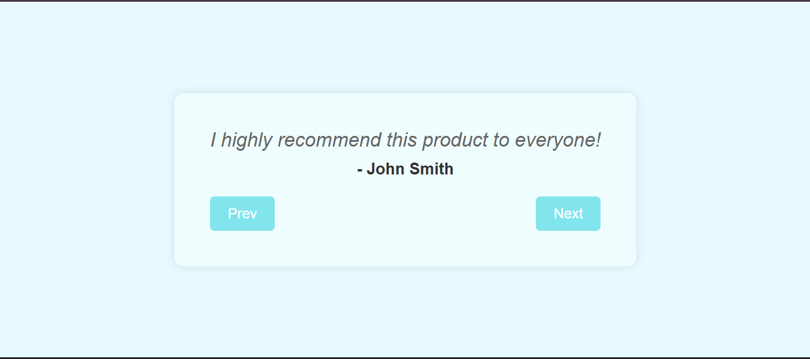

# 💬 Testimonials Project

A clean and functional **React.js project** that displays user **testimonials** with navigable controls. Users can switch between testimonials using **Prev/Next buttons**, showcasing dynamic content rendering in React using **state** and **arrays**.

---

## 📸 Preview

 <!-- Replace with actual screenshot path -->

---

## 🧠 Features

- 💬 Displays a list of **testimonial quotes**
- 🔁 **Next/Previous** navigation using buttons
- 🧠 Demonstrates **array indexing**, **state management**, and **modular logic**
- 🎯 Beginner-friendly structure using functional components

---

## 🔧 Tech Stack

- **Frontend Framework:** React.js
- **Styling:** CSS

---

## 💡 Enhancements to Try

- Add **smooth transitions/animations** between testimonials
- Include **profile images** and **ratings** for better UI
- Use **auto-play functionality** (testimonials switch automatically after a few seconds)
- Fetch testimonials from an external **API** instead of hardcoded array

---

## 🙌 Credits

- 🛠️ Built with React.js & CSS
- 💡 Inspired by common **testimonial carousels** seen in modern UI designs

---
