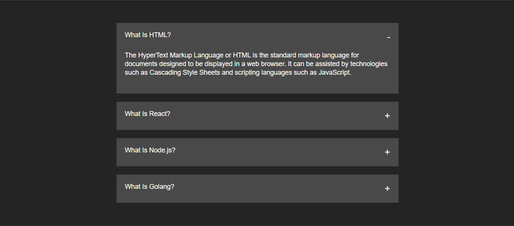

# 📂 Accordion Component

A user-friendly **React.js accordion** that allows toggling of content sections. This project demonstrates **conditional rendering**, **state management**, and how to build an **expand/collapse UI** — often used in FAQs, documentation, or settings panels.

---

## 📸 Preview

 <!-- Replace with actual screenshot path -->

---

## 🧠 Features

- 📌 Click to **expand/collapse** each section
- 🎯 Only **one section** opens at a time (optional enhancement)
- 🔄 Demonstrates **dynamic content rendering** using React state
- 🧼 Simple structure with **clean component logic**

---

## 🔧 Tech Stack

- **Frontend Framework:** React.js
- **Styling:** CSS

---

## 💡 Enhancements to Try

- Add **animations** for smooth expanding and collapsing
- Support **multiple open sections** simultaneously
- Fetch accordion content from a remote **API or JSON file**
- Add **icons** to indicate open/close state

---

## 🙌 Credits

- 🛠️ Built with React.js and CSS
- 🔗 Great for FAQ sections, feature lists, or grouped content

---
