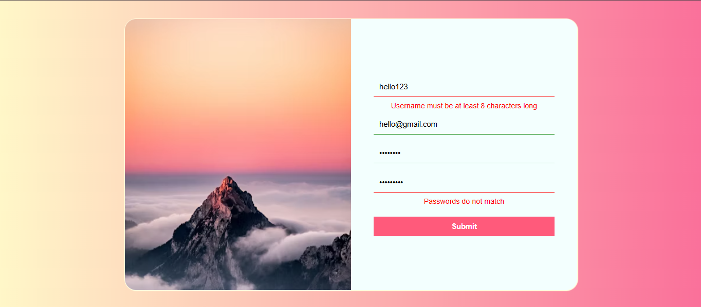

# 📝 Form Validation Project

A responsive and interactive **form validation** project built using **React.js**. This project demonstrates how to build a fully functional form that checks user input in real time and gives **visual feedback** using colored borders and error messages.

---

## 📸 Preview

 <!-- Replace with your actual screenshot -->

---

## 🧠 Features

- ✅ Validates **Username**, **Email**, **Password**, and **Confirm Password**
- 🔴 Displays **error messages** if validation fails
- 🎨 Changes **input border color** to red or green based on validity
- 🔐 Ensures passwords match before form submission
- ⚛️ Uses **React state hooks** to manage form data and feedback

---

## ⚙️ Validations Included

- `Username:` Must be at least **8 characters**
- `Email:` Must include **@gmail.com**
- `Password:` Minimum **8 characters**
- `Confirm Password:` Must **match** the password field

---

## 🔧 Tech Stack

- **Frontend Framework:** React.js
- **Styling:** CSS

---

## 💡 Enhancements to Try

- Add **regex-based email validation**
- Show **password strength indicator**
- Use **Form Libraries** like `Formik` or `React Hook Form`
- Add **success message** or redirect on valid submission

---

## 🙌 Credits

- 🛠️ Built using functional React components and state management
- 💡 Great for learning **form handling** and **UX feedback patterns**

---
